<div align="center">


<br>

<a href="https://xomnibot.in"></a>
<a href="https://youtube.com/@xomnibot"></a>
<a href="https://linkedin.com/in/xomnibot"></a>
<a href="https://x.com/xomnibot"></a>

</div>

<br>



<div align="center">

<a href="https://github.com/search?q=author%3Axomnibot+type%3Apr+is%3Amerged+-user%3Axomnibot&type=pullrequests"></a>
<a href="https://github.com/search?q=author%3Axomnibot+type%3Apr+is%3Aopen+-user%3Axomnibot&type=pullrequests"></a>
<a href="https://github.com/search?q=author%3Axomnibot+type%3Aissue+-user%3Axomnibot&type=issues"></a>

</div>

<br>

| Project | Contribution | Status |
| :-- | :-- | :-: |
| [**firstcontributions/first-contributions**](https://github.com/firstcontributions/first-contributions) <br>  | [Add xomnibot to Contributors list&nbsp;#125949](https://github.com/firstcontributions/first-contributions/pull/125949) |  |

<sub>The counters above are live. 👉 <a href="https://github.com/search?q=author%3Axomnibot+type%3Apr+-user%3Axomnibot&type=pullrequests">See every pull request I've opened</a></sub>

<br>



```bash
xomnibot@github:~$ cat mission.txt
identify → exploit → disclose → defend

xomnibot@github:~$ ls ./now
building-offensive-tooling/    reversing-malware/    ctf/    teaching-on-youtube/
```

<br>



| Project | What it is | Stack |
| :-- | :-- | :-- |
| [**websiteforxomnibot**](https://github.com/xomnibot/websiteforxomnibot) | My personal site — [xomnibot.in](https://xomnibot.in) |  |

<br>



<div align="center">


</div>

<br>



<div align="center">


<br>


<br>


<br>


</div>
